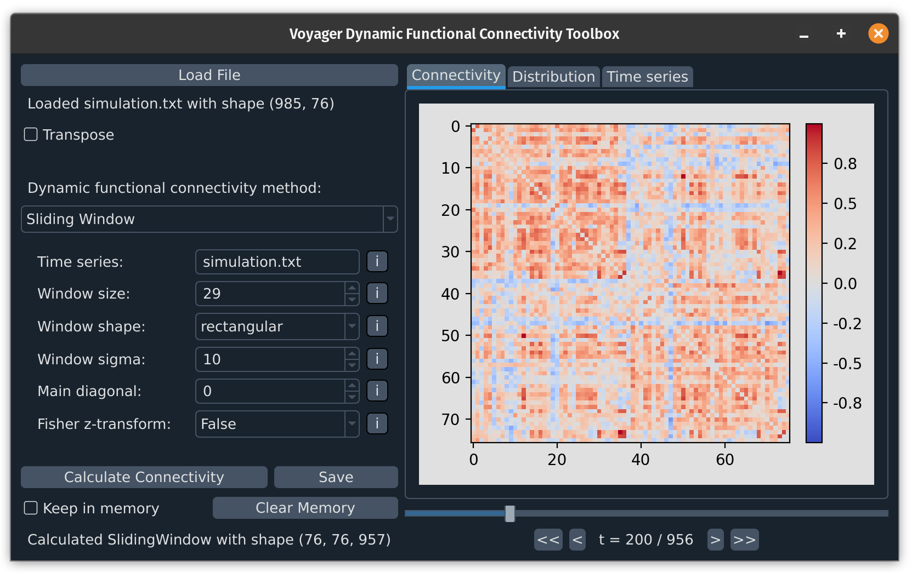

## COMET - A dynamic functional connectivity toolbox for multiverse analysis
[](https://doi.org/10.1101/2024.01.21.576546)

**Please note**: This package is in a very early stage of development, with changes being made multiple times a week. If you intend to use this package at this stage, I kindly ask that you contact me via the email address in the pyproject.toml file.

**Documentation and usage examples will follow soon.**

#### Installation

Installation through PyPI will be available soon. If you intend to try out the software already you can install it locally:

1. Download/clone the repository
2. Open a terminal in the folder which contains the pyproject.toml file
3. Install the package via pip (or pip3, depending on your environment):

```
pip install .
```

#### Usage
After installation, you can use the graphical user interface through the terminal by typing:

```
comet-gui
```

If you want to explore the toolbox with example data, you can navigate to src/comet/example_data and load the simulation.txt file which should result in two changing connectivity patterns.

If you intend to use the toolbox in a standard python script, you can use the dynamic functional connectivity functions as shown in the preprint by importing the methods module:

```
from comet import methods
```

#### Multiverse Analysis
Multiverse analysis needs urgent bugfixes and is not currently usable. It will be available soon.



