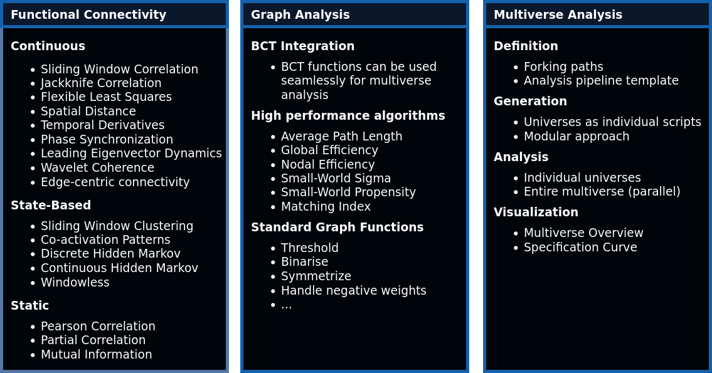

## Comet - A dynamic functional connectivity toolbox for multiverse analysis
[](https://doi.org/10.1101/2024.01.21.576546) [](https://pypi.org/project/comet-toolbox/)

**Important notes:**

* This package is at an early stage of development, with frequent changes being made. If you intend to use this package at this stage, I kindly ask that you contact me via the email address in the [pyproject.toml](https://github.com/mibur1/dfc-multiverse/blob/main/pyproject.toml) file.
* Many features are not yet tested, so there will be bugs (the question is just how many). A comprehensive testing suite and documentation will be added in the near future

### Current Features



### Installation

It is recommended to use a dedicated [Anaconda](https://www.anaconda.com/download) or [Miniconda](https://conda.io/projects/conda/en/latest/index.html) environment to mitigate the risk of potential version conflicts:

```
conda create -n comet python==3.11
conda activate comet
```

Installation is then possible through the Python Package Index (PyPI) with the pip or pip3 command, depending on your system:

```
pip install comet-toolbox
```

Installation from the source code of this repository is also possible:

1. Download/clone the repository
2. Open a terminal in the folder which contains the pyproject.toml file
3. Install the package via pip (installing in editable mode (-e) is a helpful approach if you intend to modify the source code):

```
pip install -e .
```

### Usage

**General** 

The toolbox is designed in a modular way, which means you can use the individual parts in combination with others, but also by themselves.

* continuous and static dFC measures require 2D time series data (n_timepoints x n_regions) as input
* state-based dFC methods require a TIME_SERIES object (as used in the [pydfc toolbox](https://github.com/neurodatascience/dFC)) containing data for multiple subjects as input
* Graph measures need 2D adjacency/connectivity matrices as input
* Multiverse analysis needs decision/option pairs of any kind to create forking paths in the analysis as well as a template script for the analysis


**GUI** 

After installation, you can use the graphical user interface through the terminal by typing:

```
comet-gui
```

If you want to explore the toolbox with example data, you can load data included in the ```tutorials/example_data/``` folder:

* ```simulation.txt``` contains simulated BOLD data for 10 brain regions with 2 changing brain states (usable for continuous and static dFC measures)
* ```abide_50088.txt``` contains parcellated BOLD data for a single subject from the ABIDE data set (usable for continuous and static dFC measures)
* ```aomic_multi.pkl``` contains parcellated BOLD data for 5 subjects from the AOMIC data set (usable for state-based dFC measures)


**Scripting**

If you intend to use the toolbox in a standard python script, [demo scripts](https://github.com/mibur1/dfc-multiverse/tree/main/tutorials) are provided as a starting point:

* Demo script for calculating dFC: [click here](tutorials/example_dfc.ipynb)
* Demo script for performing multiverse analysis: [click here](tutorials/example_multiverse.ipynb)
* Demo script for the multiverse analysis as presented preprint (+ additional visualizations): [click here](tutorials/example_analysis.ipynb)
* Demo script for graph analysis: [click here](tutorials/example_graph.ipynb)

### Feedback and contribution

If you have any wishes, suggestions, feedback, or encounter any bugs, please don't hesitate to contact me via email or create an issue [here](https://github.com/mibur1/dfc-multiverse/issues). Contributions or future collaboration are also welcome.