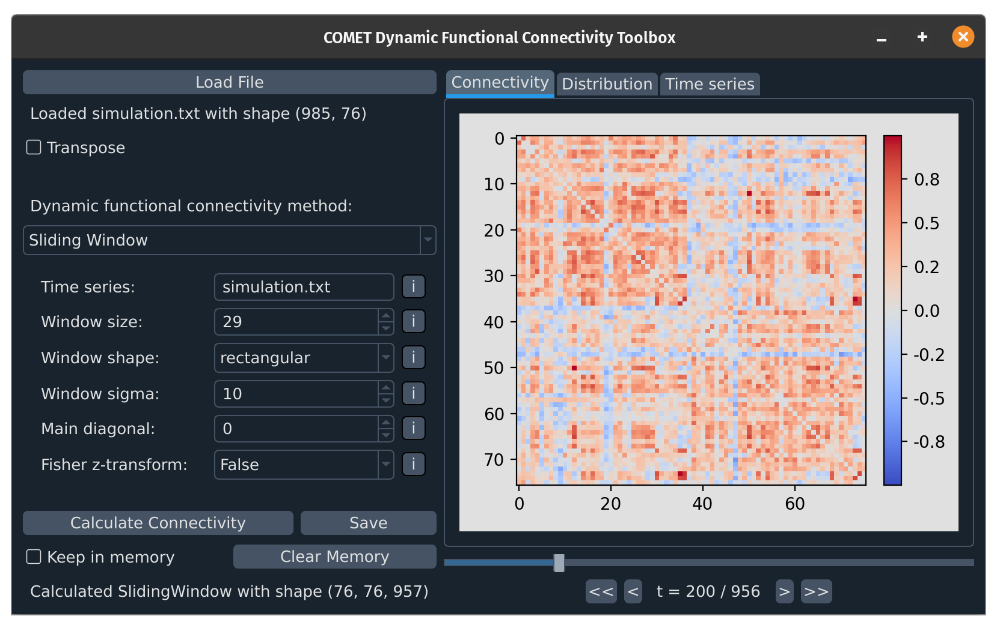

## COMET - A dynamic functional connectivity toolbox for multiverse analysis

**Please note**: This package is in a very early stage of development, with changes being made multiple times a week. If you intend to use this package at this stage, I kindly ask that you contact me via the email address in the pyproject.toml file.

Documentation and usage examples will follow soon.

